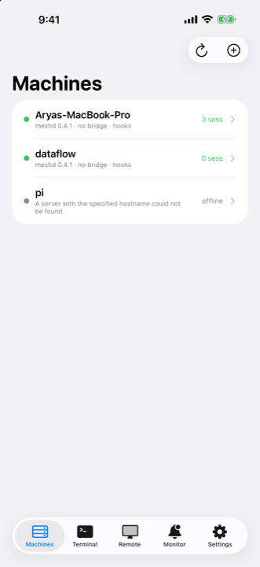
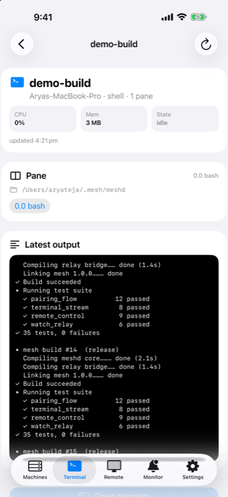
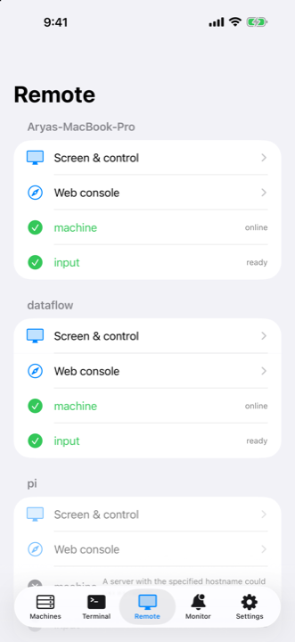
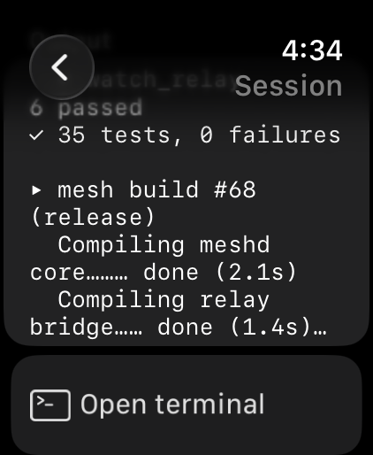
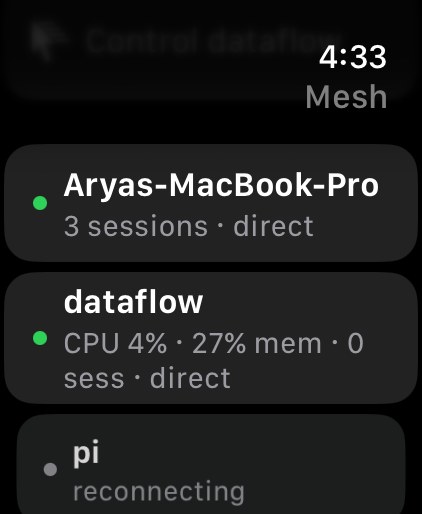

# LeSearch Mesh

**Use your Mac from your wrist.**

Your AI coding agent stops to ask a question. The watch app shows the machine, the
session and the question with Allow and Deny. Answer it, and it carries on — the
laptop never opened. When you do need the machine itself, there is a real terminal
session and a real trackpad on your phone and watch.

No account. No cloud relay. No server of ours in the path. The phone talks straight to a
small daemon on a machine you own.

> **Status: early.** It runs a small fleet daily and is on TestFlight. The install is one
> command, and so is the uninstall. Read [what is honest about it](#what-is-and-is-not-true-yet)
> before you rely on it.

Website: <https://mesh.lesearch.ai> · TestFlight:
<https://testflight.apple.com/join/pVYPTxc7> · [Changelog](CHANGELOG.md) ·
[Roadmap](ROADMAP.md)

<p align="center">
  
  
  
  
  
</p>

---

## Who this is for

People who are excited about AI agents and want to use them every day — **whether or not
they think of themselves as developers.**

Every other way to reach your machine from your phone assumes you can set up SSH keys, edit
a `known_hosts` file, or forward a port. That is the wall most people hit, and it has
nothing to do with whether they can get value out of a coding agent.

So the deal here is: **you paste one command, and one command removes it.** If a feature
needs you to understand networking, it is not finished.

## Install

Never used Terminal? On a Mac: press **⌘ Space**, type `Terminal`, press Return. Paste the
command below into the window that opens and press Return again. That is the whole skill.

On each Mac or Linux box you want to reach:

```sh
curl -fsSL https://mesh.lesearch.ai/install.sh | sh
```

Then:

```sh
mesh setup      # four steps, about a minute: permissions, then pairing
```

The wizard checks what works (`mesh doctor`, and `mesh doctor --fix` to raise the macOS
permission dialogs), then sends you to `mesh pair`, which prints a QR code and an
8-character code. Scan the QR with your iPhone camera, or open the app and type the address
and the code. The daemon hands back its own token **and every host it already knows**, so a
fleet of four machines takes one code.

There are no built-in machines and no shipped token. An empty list is the honest starting
state.

Optionally, so a blocked agent reaches your wrist:

```sh
mesh hooks install
```

## Uninstall

```sh
mesh uninstall           # shows exactly what it will delete, and stops
mesh uninstall --yes     # does it
```

It removes the daemon and its service (launchd or systemd), your token, the paired-host
list, the knowledge-base database, the hook entries it added to Claude Code's settings, and
the lines it appended to your `.zshrc`/`.bashrc` — keeping a backup of every file it edits.

It does not touch bun, tmux, your projects, or any other tool's settings, and it says so
before it runs. Nothing about setting this up should feel like a one-way door.

## What you can do

| Surface | What is on it |
|---|---|
| **Watch** | **Needs you** — every blocked agent across every machine, with the question and a one-tap answer. Live sessions, a real terminal with the full key bar, system dictation, a trackpad for the Mac, usage limits. |
| **iPhone** | Machines and stats, sessions with a **Chat** view (the agent's own conversation: prompt, reply, thinking, tool calls) beside the terminal, a native trackpad + keyboard + screen for the Mac, pairing, settings, the secrets the daemon redacted. |
| **Apps your agent builds** | Ask for an app from the phone; the `app-brief` skill interviews you, then the agent builds a native iOS app installed to your paired iPhone, or a home-screen web app your Mac serves. |
| **Complication** | How many agents are waiting, which one, and what it asked. Says when its reading is stale rather than asserting a count it cannot stand behind. |
| **Notifications** | Alerts when an agent blocks; the watch app shows the machine, the session and the question with Allow and Deny. Sent by *your* machine straight to APNs. |
| **Live Activity** | The session that needs you, on the Lock Screen and in the Dynamic Island while the app is open. Blocked outranks merely busy. |
| **Mac menu bar** | Daemon status, a plain-English permissions window, and the pairing QR. |

### Your multiplexer, not ours

Sessions are real, persistent multiplexer sessions — close the app, come back tomorrow, the
work is still there. Which multiplexer is **your** choice:

```sh
MESH_MUX=tmux    # or rmux, herdr, zellij — anything tmux-compatible
```

`rmux` is the default on macOS and `tmux` on Linux, and neither is special. The daemon
speaks the tmux command vocabulary; anything that answers it works. You can also just start
a shell session and run `herdr`, `tmux`, `python3` or anything else inside it from the watch
with **New › Command…**.

### The safety rule worth knowing

"Continue" sends a bare **Return**, and Return accepts whichever option the agent has
highlighted. So it is a *yes*, not an acknowledgement.
[`Shared/RiskClassifier.swift`](Shared/RiskClassifier.swift) reads the question (never the
session name) and, for a force-push, `rm -rf`, hard reset, `DROP TABLE`, `| sh` or `sudo`,
turns the button red and makes it name the verb. The list is deliberately narrow — flagging
everything trains the eye to skip the warning.

## How it works

```
Apple Watch ──WatchConnectivity── iPhone ──HTTP over your LAN or VPN──┬─ mac:   meshd
  needs-you · sessions · terminal   (polls every machine)             ├─ linux: meshd
  trackpad · complication · chat                                     └─ …:     meshd
                                                                           │
   agent blocks ─> mesh-hook ─> POST /events ─> redact ─> meshd signs APNs ─> phone + watch
   agent writes its transcript ─> GET /agents/<s>/chat ─> redact ─> the Chat view
```

Every line that leaves the Mac — an event, a terminal screen, a chat message, the live
terminal stream — passes through the daemon's redaction first. `ghp_ABCD…` reaches the
phone as `ghp_••••••[902dd5]`, and `mesh exposures` (or Settings → Exposed secrets) lists
each distinct secret the daemon had to hide — kind, prefix, fingerprint, count — so you
know what to rotate. Never the value.

The watch reaches the mesh through the paired iPhone when it cannot reach a machine itself,
so install the iPhone app first; the watch app follows from the Watch app on your phone.

`meshd` is a single Bun + TypeScript process, about 5,800 lines, no dependencies. It is
meant to be read before it is run: [`install/payload/meshd/`](install/payload/meshd/).

## What is, and is not, true yet

Being straight about this matters more than looking finished.

**Where it works.** On your home or office network, and over any VPN you already use —
Tailscale, NetBird, WireGuard, anything. We do not require, bundle, or recommend a
particular one.

**Off your own network, with no VPN, it does not work yet.** There is no way around that
which does not involve a rendezvous server: every product that does this — Jump Desktop,
Screens, TeamViewer, Tailscale — bootstraps a peer-to-peer connection through cloud
infrastructure and falls back to a relay. Doing it properly is on the [roadmap](ROADMAP.md)
and is an explicit choice about running one small service, not something to fake in the
meantime.

**Transport is plain HTTP with a bearer token, on your private network.** The token is
per-machine, minted by that machine during pairing, sent as a header and never in a query
string. The daemon binds `0.0.0.0:8899` so your phone can reach it, and it refuses requests
whose `Host`/`Origin` headers look like a browser, which closes an earlier hole. That is
adequate on a network you trust and **not adequate on a shared or public one** — treat it
that way until TLS lands.

**Capabilities are honest per machine.** `/health` advertises what each daemon can actually
do (`screenPeek`, `input`, `files`, `push`, `pair`, `redact`, `chat`, `apps`, …) and the app
greys out what a machine cannot do. Linux hosts have input and files but no screen capture,
and say so.

**The live terminal requires your token now.** Until 0.6 the terminal bridge on port 7820
answered anyone who could reach it. It now wants the same token as the daemon; the app
sends it as a cookie. A phone app older than 0.6 loses Terminal mode until it updates.

**Built apps, honestly.** A native app needs an Apple developer account and an iPhone in
Developer Mode that was paired with a Mac once. After that it installs without a cable:
`mesh apps ota --enable` puts the machine's install links on its Tailscale name, and the
Install button on the phone hands the link to iOS itself, from any device on your tailnet.
Off your tailnet and off your own network it does not work yet. Without Tailscale (or your
own HTTPS in front of the machine) the install goes through the Mac, so the phone must be
reachable from it. Building still needs a Mac: a Linux machine
serves an `.ipa` a Mac in your mesh built (`mesh apps add --ipa`), it does not compile one.
A web app is served by your Mac over plain HTTP on your network at an unguessable address;
it keeps its data in the browser and works while the Mac is on, and it only works offline
when you host it on HTTPS you own. Chat reads transcripts from Claude Code, Codex and
cursor-agent; other agents show as terminals.

**A green build proves very little here.** Three features have shipped correct and
completely dead — one because no hook was ever registered, one because event hostnames never
matched what pairing stored, one because every fixture used a timestamp shape the daemon
does not emit. Run it against a real daemon before believing it.

## Telemetry

The daemon sends one anonymized heartbeat per day: its version, its platform, its
uptime in hours, coarse feature counters (how many hook events landed this week, by
level, as numbers), and a random install id generated once on first send. That is the
whole list — no commands, no keystrokes, no terminal or screen content, no hostnames,
no paths, and nothing that identifies you. The apps never send anything at all.

Turn it off with `MESHD_TELEMETRY=off` in the daemon's environment (set it when you
run the installer and it is carried into the service). The daemon works identically
either way. The sending code is one small file you can read:
[`install/payload/meshd/telemetry.ts`](install/payload/meshd/telemetry.ts) — and the
full promise lives at [the privacy page](https://mesh.lesearch.ai/privacy).

## Requirements

- **iPhone** on iOS 26 or later, **Apple Watch** on watchOS 10 or later
- **Mac** on macOS 14 or later (the menu-bar app), or any **Linux** box, as a daemon host
- `bun` on each host — the installer fetches it if it is missing
- A multiplexer: `tmux`, `rmux`, `herdr` or `zellij`
- Screen control on a Mac needs Accessibility and Screen Recording permission. `mesh
  doctor` tells you exactly which are missing and `mesh doctor --fix` raises the dialogs.

## When something is wrong

```sh
mesh doctor     # what actually works on this machine, in plain words
mesh status     # every machine on one line: version, uptime, doctor score
mesh health     # is meshd even up?
mesh hosts      # what is paired, and can it be reached
```

`mesh doctor` is the source of truth for setup problems — it tests the token, input
permission, screen permission, the multiplexer and push, and says what to do about each.

## Build it yourself

```sh
xcodegen generate
xcodebuild -project MeshWatch.xcodeproj -scheme MeshWatch \
  -destination 'generic/platform=iOS Simulator' -derivedDataPath build/DerivedData build
xcodebuild -project MeshWatch.xcodeproj -scheme 'MeshWatch Watch App' \
  -destination 'generic/platform=watchOS Simulator' -derivedDataPath build/DerivedData build
sh scripts/check-all.sh
```

Contributing, and how the repo fits together: [CONTEXT.md](CONTEXT.md). File map:
[index.md](index.md).

## Layout

```
Shared/            models, MeshClient, risk classifier, glance, notification categories
iOS/               app, store, pairing, terminal, native remote screen
Watch/             watch app, store, views, remote control
WatchWidgets/      watch complication
MeshWatchWidgets/  iOS Live Activity + Dynamic Island
MeshDesktop/       Mac menu bar app — status, permissions, pairing QR
install/           the installer, the meshd payload, and the mesh CLI
scripts/           self-checks, packaging, release
web/               landing page (Vercel)
docs/              runbooks and design notes
```

## License

[MIT](LICENSE). The daemon, the CLI, the installer and the apps — all of it. The part that
runs on your machine is meant to be read before it is run.
