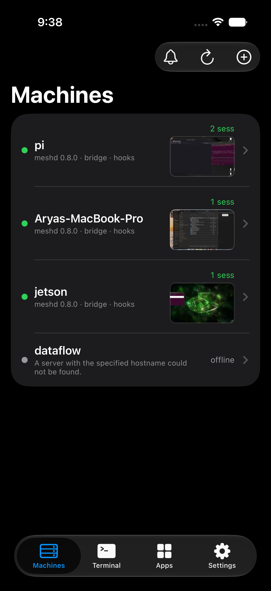
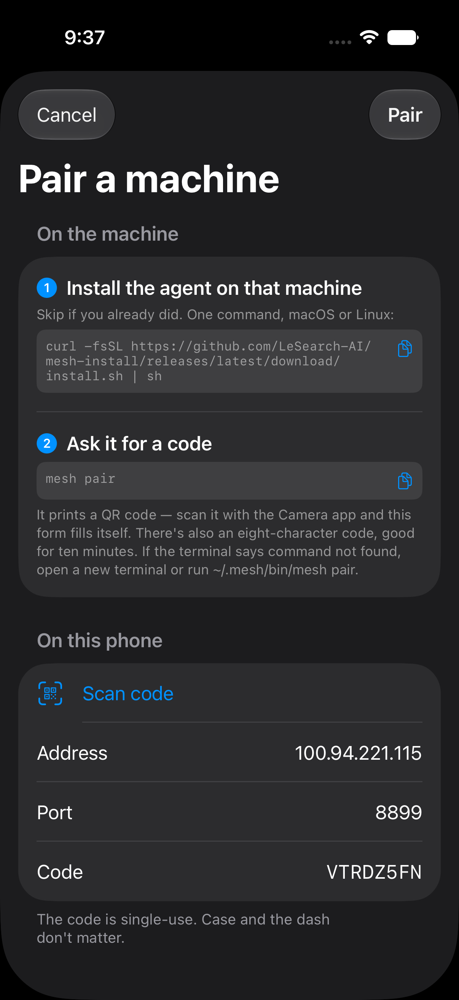
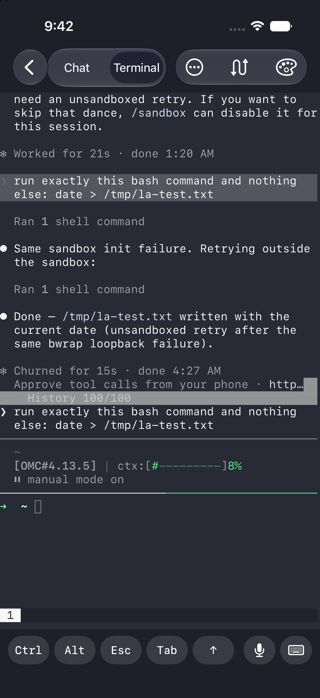
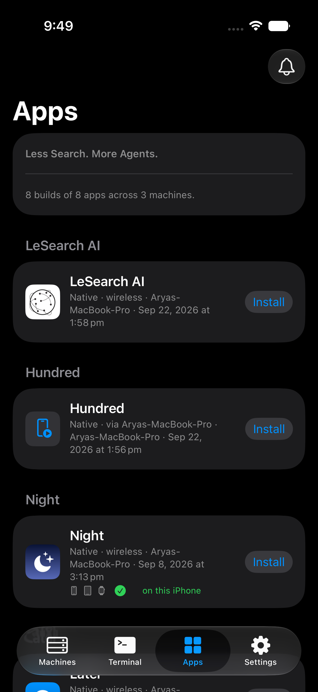
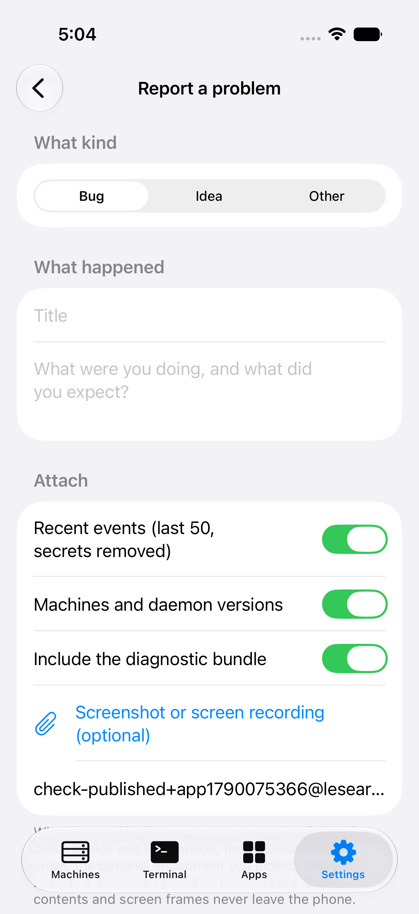
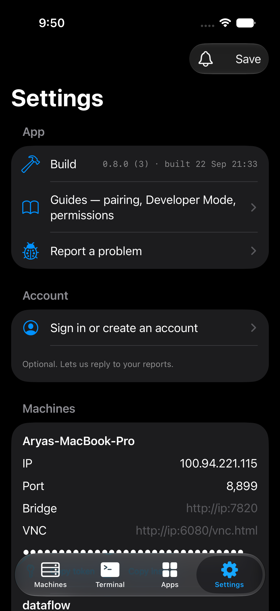

# Getting started with LeSearch AI

LeSearch AI puts every machine you own — and every coding agent running on it — on your
iPhone and Apple Watch. When Claude Code, Codex, cursor-agent or Antigravity stops on a
question, your phone (and wrist) buzzes; you read the prompt and tap **Continue**, pick a
menu option, or type back. When you need the machine itself, you get its screen, its
keyboard and a real terminal, from the phone.

This page takes you from nothing to that first buzz. It was written to be followed by
someone who has never seen the product; every command in it is copy-pasteable and every
screenshot is from the current build (0.8.0). If a step does not match what you see,
that is a bug — [report it](#5-report-a-problem-and-get-a-reply) from the app.

**No account is needed to start.** Pairing is a code your own machine prints; the only
account in the product is optional and exists so we can answer a report (step 6).

**You need:** an iPhone on iOS 26 or newer (an Apple Watch on watchOS 10+ is optional), a
Mac or a Linux box where your agents run, and a network the phone can reach that machine
on — the same Wi-Fi, or [Tailscale](https://tailscale.com) on both (recommended: it works
from anywhere and nothing of ours sits in between).

## 1. Get the app on your phone

Open **https://lesearch.ai/beta** on the iPhone and install through TestFlight (free).
The watch app installs itself from the iPhone once the phone app is on; if it does not,
open the Watch app on the phone and add *LeSearch AI* under *Available apps*.

> If you are building from source instead: `xcodegen generate`, open `MeshWatch.xcodeproj`,
> pick your team, run the `MeshWatch` scheme on your phone.



## 2. Install the daemon on a machine

On the Mac or Linux machine where your agents run:

```sh
curl -fsSL https://lesearch.ai/install.sh | sh
```

That installs `meshd` (the small daemon the phone talks to) and the `mesh` command under
`~/.mesh`, starts the daemon as a launchd job (Mac) or a user systemd service (Linux), and
makes both survive reboots. Nothing runs as root. Then:

```sh
mesh doctor
```

prints one line per thing the phone will need — daemon up, token minted, a terminal
multiplexer present, agent hooks, screen and input permissions — and says how to fix each
red one. On a Mac the first `mesh doctor --fix` shows the two system dialogs (Accessibility
and Screen Recording) that let the phone type and see the screen; on Linux nothing is
asked.

## 3. Pair the phone

On the machine:

```sh
mesh pair
```

It prints a QR code and an eight-character code. On the phone, open LeSearch AI →
**Machines** → **Pair a machine** and point the camera at the QR (or type the address and
the code). The phone shows the machine's name and the code it read; check they match what
the terminal printed, tap **Pair**. The row turns green when the phone reaches the daemon.



Pairing is the whole account model: the machine mints a token for that phone, the phone
keeps it in its Keychain, and nothing of ours is in between. Pair as many machines as you
like; each gets its own row.

## 4. Run an agent and get the first buzz

Wire the agent alerts once per machine (Claude Code today; Codex and Antigravity print
their one-line config):

```sh
mesh hooks install
```

Now start an agent from the phone — **Terminal** → **+** → pick *claude* (or any installed
agent) and a folder — or from the machine as you normally would inside a `mesh new`
session. Give it a task that will make it ask you something (`rm` a scratch file, push a
branch). When it stops:

- the phone shows a **Needs you** banner and the watch buzzes;
- the session's Chat view shows the question, and if the agent presented a menu (Claude
  Code's numbered permission list, a trust-this-folder prompt) the options are buttons;
- tap **Continue**, pick an option, or type back. The agent carries on.



That is the loop everything else serves. From here: each machine's row shows its live
screen — open it for the trackpad, the machine's own keyboard (⌘⌥⌃⇧ on a Mac, Ctrl Alt
Super on Linux) and its launcher; the **Apps** tab lists apps your agents built and lets you
install them; the bell in every tab is alerts, usage and the event log.



## 5. Report a problem, and get a reply

**Settings → Report a problem.** Pick bug / idea / other, give it a title and say what
happened. Attach a screenshot or screen recording only if you pick one yourself. The
diagnostic bundle (app build, machines and daemon versions, recent event titles, the last
error) is redacted on the phone — anything shaped like a key or token is replaced by its
kind — and you can read it before it goes. **Send to LeSearch AI** is one explicit tap;
what leaves the phone is listed right above the button.

Sent reports become public issues labeled `from-users` at
https://github.com/LeSearch-AI/mesh/issues — deduplicated, with your e-mail hashed, never
copied. The app shows you a reference; that reference is on the issue.



## 6. Account — optional, only so we can reply

Settings → **Account** lets you create an account with an e-mail and a password so we
can reply to your reports. It is used for nothing else: no login ever gates a machine,
nothing above needed it, and you can sign out any time.



## What to read next

- [The product, feature by feature, with the code that implements each](product/README.md)
- [Design system and component map](product/design-system.md)
- [Privacy — exactly what leaves your devices, and when](https://lesearch.ai/privacy)
- Guides inside the app (Settings → Guides): Developer Mode, Mac permissions, Linux
  desktops, running an agent overnight.
